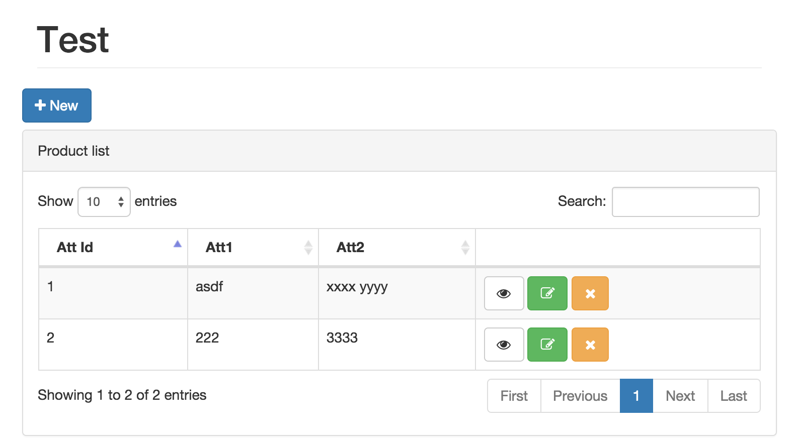
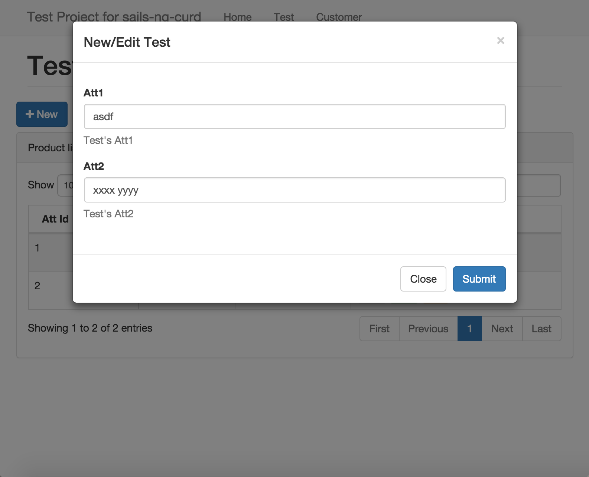

# sails-ng-curd

Generate scaffold for sails application. Ajax create/update/remove/pagination/search using JQuery and Angular.js.

CURD function based on
- [Sails](http://sailsjs.org/)
- [Angular](https://www.angular.org)
- [JQuery](https://jquery.com)
- [JQuery Datatables](https://datatables.net)
- [JQuery BlockUI](http://malsup.com/jquery/block/)
- [Angular Datatables](https://l-lin.github.io/angular-datatables/)

# Usage

## On the command line

```sh
$ sails generate ng-curd <a name for your scaffold> <primarykey> <optional: attributename:attributetype> <optional: --force>
```

Example:

```sh
$ sails generate scaffold user id name:string age:integer email:email
```

## Example Project

- [Test Project](https://github.com/shootsoft/sails-ng-curd/tree/master/tests)
- [WeBuyer](https://github.com/shootsoft/webuyer)

## Quick Start

1. Define your Model

`api/models/Test.js`

```javascript
module.exports = {

  attributes: {

    att_id : {     
    	type: 'integer',
        primaryKey: true 
    },

    att1 : { type: 'string' },

    att2 : { type: 'string' }
  }
};
```

2. Add JQuery, Bootstrap, JQuery Datatables, JQuery Block UI, Angular, Angular Datatables into your layout file 

Examples: https://github.com/shootsoft/sails-ng-curd/blob/master/tests/views/layout.ejs


3. Generate your controller/view/js

```sh
sails generate ng-curd test att_id att1 att2
```

4. Launch your sails and visit http://localhost:1337/Test
```sh
sails lift
```
# UI Prevew






#TODO

- complete test project
- support attribute type
- help file
- quick start
- auto load model's attributes
- angular module